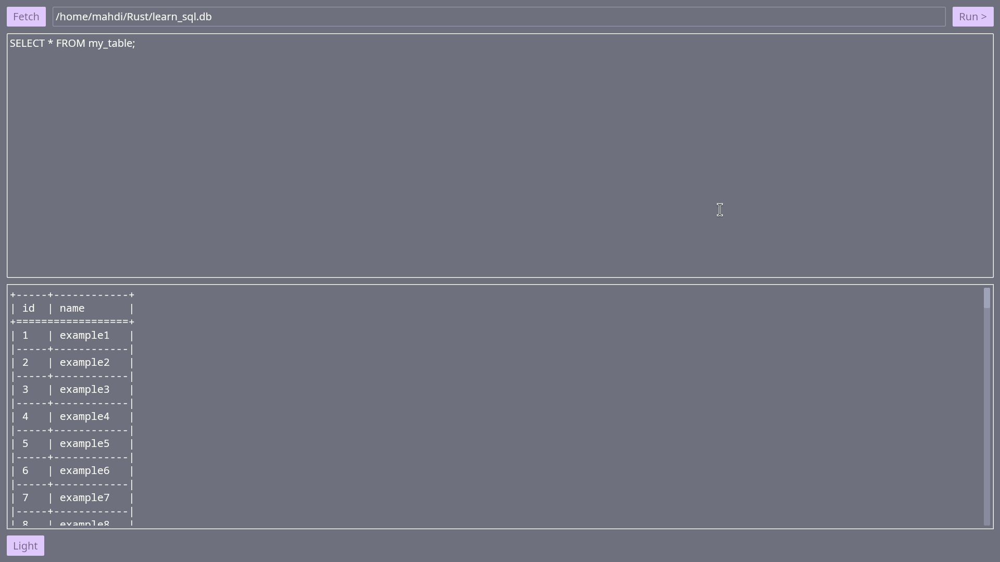

# Rusty Query Lab

A lightweight SQL playground built with Rust, SQLite, SQLx, and Iced.

## Screenshot

## Overview

RQ Lab is a small desktop SQL playground written in Rust.
It provides a code editor for writing SQL queries 
and a result panel for displaying query results.

## Features

- Write SQL queries in a built-in editor
- Execute queries against SQLite
- Display query results
- Create and modify database tables
- Switch between different application modes
- Switch between light and dark themes
- Persist application settings between sessions

## Technologies

- **Rust** — application programming language
- **SQLite** — database engine
- **SQLx** — database access
- **Tokio** — asynchronous runtime
- **Iced** — GUI framework
- **Comfy Table** — formatting query results as tables
- **Serde** — serialization and deserialization
- **Serde JSON** — JSON-based application settings
- **dirs** — locating platform-specific user directories

## Getting Started

### Requirements

- Rust
- Cargo

Clone the repository and run:

cargo run

## License

This project is licensed under the GNU General Public License v3.0 or later.
See [LICENSE.md](LICENSE.md) for details.
